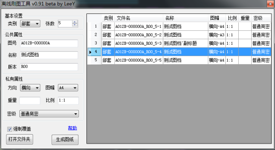
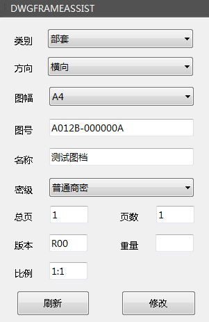
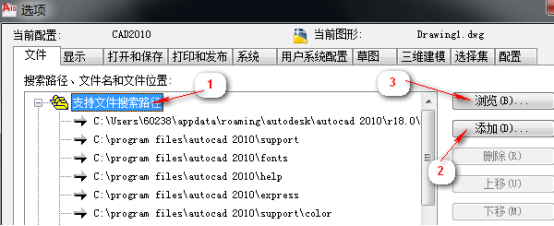
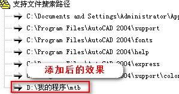
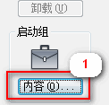
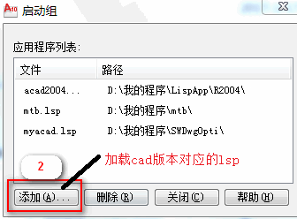
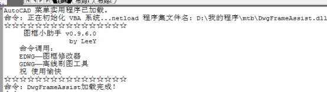
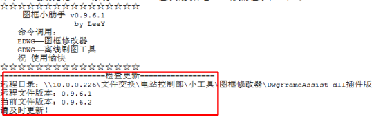
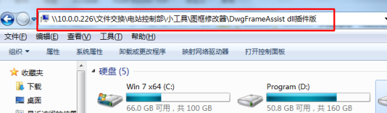

## DwgFrameAssist v0.97

**离线一键刷图工具 + 图框修改器**

**注意**
不同的CAD版本请使用不同的自动加载文件，见安装方法第3点。
autoLoad.lsp：Cad2008-2012用，2010版已测试可用，其余版本请测试，如有问题请反馈。
autoLoad2016.lsp:Cad2013-2016用，2013/2016版已测试可用，其余版本请测试，如有问题请反馈。

## 概要
此CAD插件用来替代PLM自带刷图工具，提供刷图功能及图框修改功能。
此为CAD插件，需启动CAD配合使用；与PLM无关，无需先启动PLM。
只提供命令行版本，未做工具栏或菜单按钮。三个命令：
**gdwg**——离线刷图工具
**edwg**——图框修改器
**dwgtest**——测试插件是否加载成功

## 离线刷图工具 
>使用教程具体可看软件界面的帮助。
1. 支持部套或零件的图纸生成，图幅横向、纵向的A0~A4均可；
2. 支持一次性生成多张图纸。
3. 支持自定义单张图纸的部分信息。
4. 支持双行正、副标题。

## 图框修改器
注意：不支持图框炸开的图纸。
更新：增加修改图幅的功能。
可更改标题栏的信息；
可更改图框尺寸、横向纵向、部套或零件图。
可识别新版和旧版的图框信息。

>注意：首次启动图框修改器时，其位置可能停靠在边缘，尺寸显示也可能有问题，请自行调整。拖不动的，请在工具栏上右键选择取消锁定位置。

## 安装方法
1. 将文件夹内所有文件复制到某文件夹保存，如D:\我的程序\mtb;
2. 添加”D:\我的程序\mtb”到cad支持路径;
打开cad，在绘图区域右键单击，选择”选项”，按下图1/2/3顺序将文件路径添加到支持文件搜索路径。

3. 添加autoLoad脚本到启动组；
选择菜单栏->工具->加载应用程序，在弹窗右下角点击”内容”按钮，按如下1/2步，将autoLoad***.lsp加入启动组。

4. 重启cad
如命令行看到加载成功的提示信息表明加载成功。

## 更新
默认加载插件时会检查更新。请注意提示信息。

### 更新方法
1. 复制提示信息中的远程目录路径” \\10.0.0.226\文件交换\电站控制部\小工具\图框修改器\DwgFrameAssist dll插件版”，粘贴到我的电脑地址栏，回车。
2. 关闭cad，将远程目录中的文件复制到本地覆盖原文件即可。

## 自定义
支持添加图幅